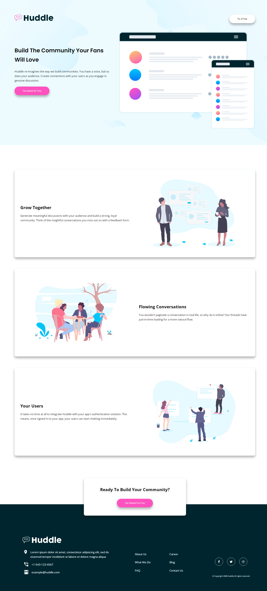

# Frontend Mentor - Huddle landing page with alternating feature blocks

## Table of contents

- [Overview](#overview)
- [The challenge](#the-challenge)
- [Screenshot](#screenshot)
- [Links](#links)
- [Built with](#built-with)
- [Author](#author)

## Overview

This is a solution to the Clipboard landing page challenge on Frontend Mentor.

### The challenge

Users should be able to:

- View the optimal layout for the component depending on their device's screen size
- See a hover state on desktop for the Sign Up call-to-action

### Screenshot

### Links

- Solution URL: []
- Live Site URL: []

### Built with

- Semantic HTML5 markup
- SASS custom properties
- Flexbox
- CSS Grid
- Desktop-first workflow

## Author

- Frontend Mentor - [@venkateshb](https://www.frontendmentor.io/profile/venkateshbaddela)
